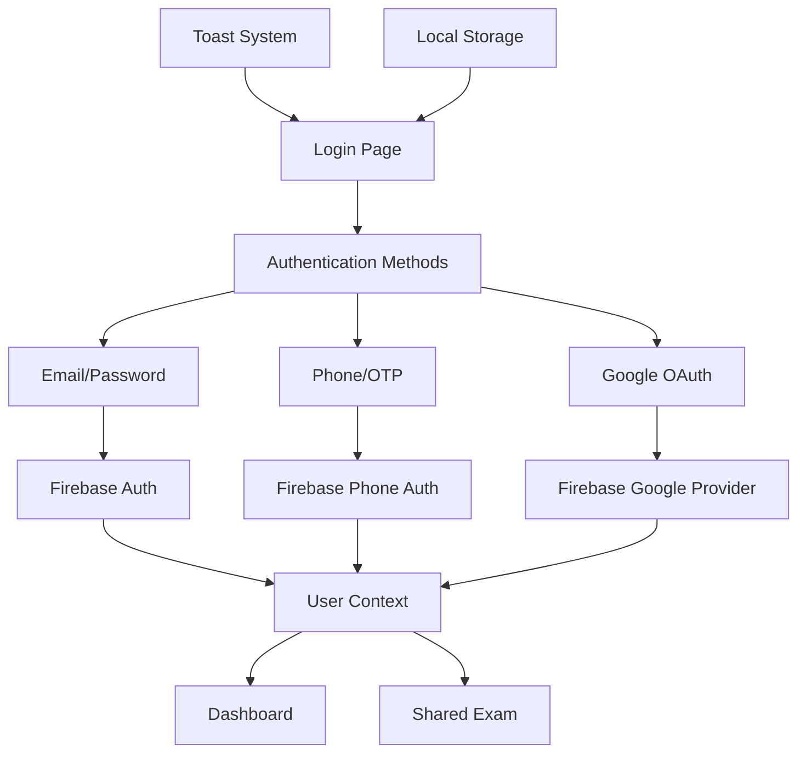

# Design Document

## Overview

This design document outlines the comprehensive login system that will replace the existing basic email/password login with a multi-method authentication system. The system will support email/password login, phone number login with OTP verification, Google OAuth login, and seamless handling of shared exam link redirections.

The design leverages the existing Next.js architecture, Firebase authentication system, and UI components while adding new authentication methods and improved user experience features.

## Architecture

### High-Level Architecture



### Component Structure

```
LoginPage (Main Component)
├── TabsContainer
│   ├── EmailTab
│   │   ├── GoogleLoginButton
│   │   └── EmailPasswordForm
│   └── PhoneTab
│       ├── PhoneNumberInput
│       └── OTPVerification
├── SharedExamNotification
└── ToastNotifications
```

## Components and Interfaces

### 1. Main Login Page Component

**File:** `src/app/login/page.tsx`

**Props:** None (page component)

**State Management:**
- Form states for email, password, phone number, OTP
- Loading states for different authentication methods
- UI state for active tab, verification flow
- Timer state for OTP resend functionality

**Key Features:**
- Tab-based interface switching between email and phone login
- Shared exam link detection and notification
- Comprehensive error handling and user feedback

### 2. Authentication Methods

#### Email/Password Authentication
- Utilizes existing `login` method from ExamContext
- Form validation for email format and required fields
- "Forgot Password" link integration
- Loading states during authentication

#### Phone/OTP Authentication
- Phone number validation for Indian numbers (+91 format)
- Integration with Firebase Phone Authentication
- OTP input with 6-digit validation
- Resend OTP functionality with 30-second cooldown
- User existence check before sending OTP

#### Google OAuth Authentication
- Integration with existing `loginWithGoogle` method
- Popup handling and error management
- Popup blocker detection and user guidance

### 3. UI Components Integration

**Required UI Components:**
- `Tabs`, `TabsContent`, `TabsList`, `TabsTrigger` - Method selection
- `Card`, `CardHeader`, `CardContent`, `CardFooter` - Layout structure
- `Button` - All interactive elements
- `Input` - Form inputs
- `Label` - Form labels
- `Loader2` (from lucide-react) - Loading indicators

**Toast Integration:**
- Success notifications for successful authentication
- Error notifications with specific error messages
- OTP sent confirmations
- Redirection notifications for shared exams

## Data Models

### Authentication State

```typescript
interface LoginState {
  // Email login
  email: string;
  password: string;
  
  // Phone login
  phoneNumber: string;
  otp: string;
  verificationId: string;
  
  // Loading states
  isLoading: boolean;
  isGoogleLoading: boolean;
  isPhoneLoading: boolean;
  isVerifying: boolean;
  
  // UI state
  activeTab: "email" | "phone";
  resendTimer: number;
  
  // Shared exam handling
  isFromSharedLink: boolean;
}
```

### Phone Number Validation

```typescript
interface PhoneValidation {
  isValid: boolean;
  formattedNumber: string;
  e164Format: string;
  internationalFormat: string;
}
```

## Error Handling

### Error Categories

1. **Authentication Errors**
   - Invalid credentials
   - User not found
   - Account disabled

2. **Phone Authentication Errors**
   - Invalid phone number format
   - Phone number not registered
   - OTP verification failed
   - Too many attempts

3. **Google Authentication Errors**
   - Popup blocked
   - User cancelled
   - Network errors

4. **System Errors**
   - Network connectivity
   - Firebase service errors
   - Timeout errors

### Error Display Strategy

- Toast notifications for all error types
- Specific error messages for different scenarios
- Retry mechanisms for transient errors
- User guidance for resolvable issues (e.g., popup blockers)

## Testing Strategy

### Unit Testing

1. **Component Testing**
   - Form validation logic
   - State management
   - Event handlers
   - Tab switching functionality

2. **Authentication Flow Testing**
   - Email/password login flow
   - Phone/OTP verification flow
   - Google OAuth flow
   - Error handling scenarios

3. **Utility Function Testing**
   - Phone number validation
   - Format conversion
   - Timer functionality

### Integration Testing

1. **Firebase Integration**
   - Authentication method integration
   - Error handling from Firebase
   - User context updates

2. **Navigation Testing**
   - Dashboard redirection
   - Shared exam redirection
   - Error state handling

3. **Toast Integration**
   - Success notifications
   - Error notifications
   - Timing and display

### User Experience Testing

1. **Accessibility Testing**
   - Keyboard navigation
   - Screen reader compatibility
   - Focus management

2. **Responsive Design Testing**
   - Mobile device compatibility
   - Tablet layout
   - Desktop experience

3. **Performance Testing**
   - Component rendering performance
   - Authentication response times
   - Memory usage optimization

## Implementation Considerations

### Dependencies

**New Dependencies Required:**
- `libphonenumber-js` - Phone number parsing and validation
- `lucide-react` - Loading icons (if not already installed)

**Existing Dependencies:**
- Firebase Auth (already configured)
- Next.js navigation
- Existing UI components
- Toast system

### Security Considerations

1. **Phone Authentication Security**
   - reCAPTCHA integration for spam prevention
   - Rate limiting for OTP requests
   - Secure OTP verification

2. **Data Protection**
   - No sensitive data in localStorage
   - Secure token handling
   - Proper session management

3. **Input Validation**
   - Client-side validation for UX
   - Server-side validation for security
   - Sanitization of user inputs

### Performance Optimizations

1. **Code Splitting**
   - Lazy loading of authentication providers
   - Dynamic imports for heavy libraries

2. **Caching Strategy**
   - User preference caching
   - Authentication state persistence
   - Optimized re-renders

3. **Bundle Size**
   - Tree shaking for unused code
   - Optimized imports
   - Minimal dependency footprint

### Accessibility Features

1. **Keyboard Navigation**
   - Tab order management
   - Enter key submission
   - Escape key handling

2. **Screen Reader Support**
   - Proper ARIA labels
   - Status announcements
   - Error message association

3. **Visual Accessibility**
   - High contrast support
   - Focus indicators
   - Loading state announcements